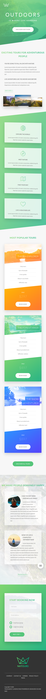

# Tour Agency

##

In this web app created advanced layout using Css. Final result demonstration


> This web App create used HTML + <a href='https://sass-lang.com/'>Sass</a> <i>syntactically awesome style sheets</i> which would be converted to pure css file which then would be used to styling page components on its places. THis oparation done by Node-Sass complier but in order to see the project it is enoght to open <b>index.html</b> file.

## Built With

- Html
- Css
- Sass
- Npm

## Deployed on GitHub Pages

Deployed on [GitHub Pages](https://pages.github.com/)

### [Live Demo Link](https://bekhzod96.github.io/tour-agency/)

## Getting Started

In order to start this project, you will need:

1. Get a copy of this project [this repository :tour-agency:](https://github.com/Bekhzod96/tour-agency.git)

Once you have cloned this project

1. Go to folder project - <i>\$ cd ./tour-agency</i>
2. Look for the `index.html` file and open in your browser - <i>\$ cd ./index.html</i>
3. In order to make a changes to the project take a look **How to Use Section**

## Improvements

Features I am going to add to this app:

- Move from HTML and vanilla CSS to React framework

## Acknowledgement

Design inspired by [Jonas Schmedtmann]() on Behance

## How To Use

To clone and run this application, you'll need [Git](https://git-scm.com) and [npm](https://nodejs.org/en/) installed on your computer. From your command line:

```bash
# Clone this repository
$ git clone https://github.com/Bekhzod96/tour-agency.git

# Go into the repository
$ cd tour-agency

# Install dependency
$ npm install

# Run Compiler
$ npm run compile

# Install live-server globaly
$ sudo npm install -g live-server

# Run Live-Server
$ live-server

# Build Ready Code
$ npm run build

## You are good to go to modify the files and all changes would be render to http://127.0.0.1:8080- Go to that link to see changes.

## To Understand more take a look File Structure section

```

## File Structure

```bash
# Entry point
$ cd ./tour-agency/index.html

# Sass files
$ cd tour-agency/sass

# Assets
$ cd ./tour-agency/img

# Compiled css
$ cd ./tour-agency/css

# Npm Documentation
$ cd ./tour-agency/package.json

```

## Author

👤 **Bekhzod Akhrorov**

- Github:[@Bekhzod96](https://github.com/Bekhzod96)
- Twitter: [@Begzod](https://twitter.com/25d47e8987f740b)
- Linkedin:[@Bekhzod AKhrorov](https://www.linkedin.com/in/bekhzod-akhrorov/)

## 🤝 Contributing

Contributions, issues, and feature requests are welcome!

## Show your support

If you got until here, show your love hitting the ⭐️ button, I'd really appreciate it.

## 📝 License

This project is [MIT](LICENSE) licensed.

## Mobile Screen view


